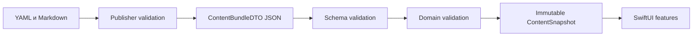

# Доменная модель контента

- Статус: `proposed`
- Аудитория: редакция, content tooling, iOS-разработка
- Transport schema: [content-v1.schema.json](../contracts/content-v1.schema.json)
- Последнее обновление: 2026-09-01

## Назначение

Модель разделяет редакционный исходник, wire DTO и проверенный domain snapshot. Приложение не должно показывать частично декодированный или частично проверенный набор.

## Три модели

### Editorial authoring

Удобные для редактора Markdown и YAML. Они могут содержать комментарии, черновые поля и workflow-статусы. Эти файлы не читаются приложением и не определяют wire-совместимость.

### Transport DTO

JSON, полностью описанный JSON Schema v1. Swift-типы получают суффикс `DTO`. Любое неизвестное поле или enum в schema v1 считается несовместимостью.

### Validated domain

Неизменяемые типы без технических суффиксов. Snapshot создаётся только после schema- и domain-validation. UI не работает с DTO и не делает повторную редакционную проверку.

## Идентификаторы

Все ID стабильны, регистрозависимы и не переиспользуются после удаления объекта.

| Объект | Пример |
|---|---|
| Сущность | `person:elon-musk`, `organization:tesla` |
| Профиль | `profile:elon-musk` |
| Claim | `claim:tesla-ownership-2026` |
| Source | `source:tesla-10k-2025` |
| Relationship | `relationship:musk-tesla-ownership` |
| Wealth estimate | `wealth:elon-musk-2026-08` |
| Timeline event | `timeline:elon-musk-spacex-founded` |
| Edition | `edition:2026-09-01-elon-musk` |

Формат — namespace, двоеточие и lowercase kebab-case. Переименование человека или компании не меняет существующий ID.

## Сущности

`Entity` представляет узел графа:

- `person`;
- `organization`;
- `university`;
- `foundation`;
- `family`;
- `deal`;
- `event`.

`family` используется только для именованной семейной группы или династии. Простое родство двух людей моделируется relationship kind `family` без обязательного family-узла.

Каждая сущность имеет ID, kind, русское имя, краткое имя и нейтральное summary. Для публикуемого человека обязателен портрет с лицензионными метаданными.

## Медиа

`MediaAsset` содержит:

- HTTPS URL и source page URL;
- MIME type;
- width, height и byte size;
- SHA-256;
- license;
- автора и готовую attribution string.

Допустимые licenses v1: `cc0`, `cc-by-4.0`, `cc-by-sa-4.0`, `public-domain`, `proprietary-permission`. Значение `unknown` запрещено в публикуемом dataset.

## Профиль человека

`PersonProfile` связывает person entity с:

- редакционным story;
- starting conditions;
- одним или несколькими wealth estimates;
- минимум шестью timeline events;
- relationship IDs образования;
- claims существенных споров;
- датой последней полной проверки.

Не каждый person entity обязан иметь полный профиль: в графе допустимы supporting persons. Ровно 15 профилей являются редакционным инвариантом MVP, а не ограничением schema.

## Оценка состояния

`WealthEstimate` содержит:

- person ID;
- `amountUsd` как строку целого числа USD;
- `asOf` в формате `YYYY-MM-DD`;
- источник или источники;
- методологическую оговорку;
- компоненты состояния.

Компонент может иметь сумму, но сумма компонентов не обязана равняться общей оценке: частные активы, долги и методика источника могут не давать аддитивную структуру. Приложение не пересчитывает и не усредняет оценки разных издателей.

Оценка старше 45 календарных дней получает доменное состояние `stale` при presentation mapping; wire-поле `stale` не хранится.

## Timeline

Каждое событие имеет person ID, точную date-only дату, заголовок, краткое объяснение, claim IDs и category: `origin`, `education`, `career`, `company`, `wealth`, `deal`, `philanthropy`, `controversy`.

Если известен только год или месяц, редакция не выдумывает день. Для v1 такой материал остаётся в story до появления проверяемой date-only даты. Поддержка partial dates потребует schema v2.

## Claims и sources

`Claim` — минимальный доказуемый тезис. Он содержит subject ID, kind, текст, уровень риска, source IDs и дату проверки. Если subject — relationship, claim также содержит `relationshipPosition`: `supports` или `challenges` относительно опубликованной формулировки связи.

Kinds: `biography`, `wealth`, `education`, `ownership`, `relationship`, `controversy`.

Risk levels:

- `routine` — обычный биографический факт;
- `material` — факт, существенно влияющий на объяснение капитала;
- `sensitive` — обвинение, судебный статус, санкция, семейная или иная репутационно чувствительная информация.

`Source` хранит библиографию и tier, но не копию материала. Tiers: `primary`, `authoritative-registry`, `reputable-reporting`, `structured-open-data`.

## Relationships

`Relationship` содержит source entity, target entity, kind, direction, status, период и claim IDs.

Kinds v1:

- `family`;
- `founded`;
- `cofounded`;
- `employment`;
- `executive_role`;
- `board_role`;
- `ownership`;
- `investment`;
- `deal`;
- `education`;
- `philanthropy`;
- `legal_dispute`.

`direction` равен `directed` или `undirected`. Для directed relationship source/target имеют семантический порядок. Период допускает отсутствующий `startDate` или `endDate`, если точная дата неизвестна; редакционное объяснение обязано снять неоднозначность.

Статус хранится только в Relationship:

- `confirmed` — стандарт доказательности выполнен;
- `disputed` — опубликованы минимум две содержательно противоположные позиции.

Claim не содержит собственного поля `confirmed/disputed`, чтобы избежать двух источников истины. `relationshipPosition` описывает направление конкретного доказательства, а не итоговый статус связи. Для `confirmed` все связанные claims должны поддерживать формулировку; для `disputed` обязательны как минимум один `supports` и один `challenges`.

Для education relationship обязательно `educationDetail`: `attended`, `graduated`, `degree`; при `degree` указывается degree name. Значение «учился» не преобразуется в «окончил».

## Edition и расписание

`FeaturedEdition` имеет date-only ключ, featured person ID, заголовок, thesis и начальные visible entity/relationship IDs. Edition не создаёт отдельную раскладку и не меняет координаты сцены.

Dataset содержит `fallbackEditionId`. Выбор для локальной даты описан в [UX-спецификации](../ux/experience.md).

## Graph layout

`GraphLayout` содержит version, width/height `10000 × 10000` и позицию каждой graph entity. Camera transform и текущая visibility не входят в content model.

Все координаты конечны и находятся в границах сцены. Обновление layout может изменить позиции только с увеличением `layoutVersion`; сохранение пользовательской камеры между разными layout version не гарантируется.

## Инварианты

### Проверяемые JSON Schema

- типы и обязательные поля;
- enum и форматы строк;
- диапазоны координат и размеров;
- `additionalProperties: false`;
- минимальное число источников и событий;
- идентичные полные элементы не дублируются через `uniqueItems`.

### Проверяемые domain validator

- уникальность ID по ключевому полю;
- отсутствие dangling references;
- соответствие namespace типу объекта;
- person profile ссылается на person entity;
- каждый видимый узел имеет layout position;
- каждый relationship имеет claims, а каждый claim — sources;
- confirmed relationship содержит только поддерживающие claims, а disputed — минимум один `supports` и один `challenges`;
- все relationship IDs education существуют и имеют education detail;
- fallback edition существует;
- ровно 15 профилей в MVP release;
- редакционные требования по tier источников;
- URL и лицензия медиа разрешены для публикации.

JSON Schema не выражает всю ссылочную целостность. Поэтому domain-invalid fixtures могут проходить `ajv`, но обязаны отклоняться publisher и Swift domain validator.

## Ошибки совместимости

- Unsupported `schemaVersion` отклоняет dataset целиком.
- Неизвестный enum в поддерживаемой версии отклоняет dataset.
- Additive wire field требует новой schema version, поскольку v1 закрыта через `additionalProperties: false`.
- Ошибка одного объекта не приводит к частичной публикации snapshot.

## Связанные документы

- [Content schema](../contracts/content-v1.schema.json)
- [Доставка контента](../tech/content-delivery.md)
- [Редакционная политика](../editorial/evidence-policy.md)
- [ADR доказательного графа](../adr/0003-evidence-graph.md)
