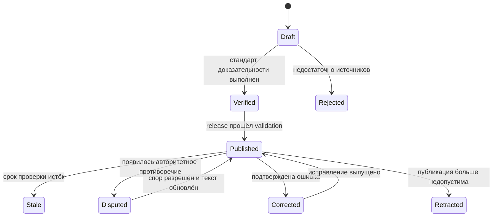

# Редакционная и доказательная политика

- Статус: `accepted`
- Публикационный статус: `blocked for publication` до лицензионной и юридической проверки
- Последнее обновление: 2026-09-01

## Цель

Политика определяет, какой факт может попасть в приложение, как показывается неопределённость и когда материал должен быть исправлен или снят. Она не является юридическим заключением.

## Редакционная позиция

- Тон — нейтрально-аналитический.
- Приложение не героизирует богатство и не обещает воспроизводимых «секретов успеха».
- Наследство, стартовый капитал, связи, государственная поддержка, партнёры и привилегии не опускаются ради self-made сюжета.
- Негативный эпизод включается не ради сенсации, а когда влияет на капитал, контроль, доказательную сеть или понимание пути.
- Факт, интерпретация редакции и неизвестное отделяются явно.

## Иерархия источников

| Tier | Тип | Примеры | Роль |
|---|---|---|---|
| `primary` | Первичный | filings, решения суда, официальные заявления, годовые отчёты | Основное доказательство факта |
| `authoritative-registry` | Официальный реестр | государственный корпоративный или образовательный реестр | Владение, роль, регистрационные сведения |
| `reputable-reporting` | Авторитетная журналистика | издание с редакционной ответственностью и указанными авторами | Независимое подтверждение и контекст |
| `structured-open-data` | Открытая структурированная база | Wikidata с ссылками на источники | Поиск кандидатов и перекрёстная проверка |

Wikipedia, социальная сеть, поисковая выдача и AI-ответ используются только как leads. Они не становятся единственным основанием чувствительного claim.

## Стандарт по уровню риска

### `routine`

Достаточно одного первичного/реестрового источника либо одного авторитетного независимого материала, если факт не оспаривается.

### `material`

Требуется первичный источник либо два независимых авторитетных источника. Пример: происхождение крупной доли состояния или роль в ключевой сделке.

### `sensitive`

Требуются первичный документ и независимое авторитетное освещение, когда они доступны. Обязательно фиксируются процессуальный статус, дата, позиция другой стороны и изменения после публикации. Обвинение не описывается как установленный факт до соответствующего решения.

## Связи

### `confirmed`

Показывается сплошной линией после выполнения стандарта соответствующего risk level.

### `disputed`

Показывается пунктиром только при наличии минимум двух содержательно противоположных документированных позиций. Карточка объясняет, что именно оспаривается.

### Не публикуется

- предположение по совместной фотографии;
- присутствие на одном мероприятии;
- подписка или взаимодействие в соцсети;
- общий вуз в разные периоды;
- общий работодатель без пересечения и доказанного контакта;
- формулировка «вероятно знакомы» без источника.

Общий вуз, компания или фонд остаётся отдельным узлом и не создаёт person-to-person relationship автоматически.

## Оценки состояния

- Всегда использовать слово «оценка».
- Показывать USD, source и `asOf`.
- Не усреднять Forbes, Bloomberg и другие модели.
- Не пересчитывать сумму между редакционными обновлениями по котировкам.
- Не копировать рейтинг пакетно и не использовать неофициальный scraping.
- Компоненты состояния объясняют модель, но не обязаны арифметически давать total.
- После 45 дней данные помечаются stale.
- Плановый cadence — один раз в месяц и после материального события.

Право повторно использовать конкретную сумму должно быть проверено отдельно. Ссылка на публикацию не равна лицензии на создание производной базы.

## Образование

Различаются:

- `attended` — учился или посещал;
- `graduated` — окончил;
- `degree` — получил конкретную степень.

Статус `degree` требует названия степени и источника. Почётная степень не смешивается с академическим обучением. Если точный статус не подтверждён, редакция пишет только доказанную часть.

## Споры, суды и санкции

Материал включается, если он существенен для капитала, контроля, деловой сети или понимания публичной роли. Карточка содержит:

- юрисдикцию и орган;
- дату и текущий статус;
- точную формулировку претензии или решения;
- позицию героя или организации;
- связанные финансовые или управленческие последствия;
- дату последней проверки.

Снятое обвинение, отменённое решение или завершённая санкция обновляются без задержки после подтверждения.

## Медиа

Для каждого файла обязательны source page, автор, лицензия, attribution, SHA-256 и фактическое право на повторное использование.

Допустимые лицензии v1:

- CC0;
- CC BY 4.0;
- CC BY-SA 4.0;
- public domain;
- письменное proprietary permission.

Публичная фотография без установленной лицензии не загружается в R2. Attribution показывается в разделе лицензий; если лицензия требует более заметного размещения, выполняется её конкретное условие.

## Авторское право и цитирование

- Текст пишется редакцией своими словами.
- Длинные цитаты и воспроизведение статей запрещены.
- Короткая цитата используется только когда сама формулировка существенна и допустима по праву/лицензии.
- Библиография хранит метаданные и URL, но не обход paywall и не архивирует чужой материал без права.

## Workflow claim

Wire dataset содержит только опубликованное состояние. Draft/rejected workflow остаётся в authoring model и редакционном журнале.

## Исправления

Для сообщения нужны URL/ID профиля, спорный тезис и предлагаемое основание. Редакция:

1. подтверждает получение;
2. определяет risk level;
3. при критическом риске временно снимает claim/relationship;
4. перепроверяет источники;
5. публикует новую content version;
6. сохраняет запись об исправлении.

В приложении указывается канал исправлений до внешнего TestFlight. Конкретный адрес пока не определён и является операционным блокером распространения.

## Checklist публикации

- [ ] У каждого claim есть source.
- [ ] Standards по risk level выполнены.
- [ ] Сумма датирована и названа оценкой.
- [ ] Disputed relationship содержит противоположные позиции.
- [ ] Нет автоматически выведенных личных связей.
- [ ] Фото имеет проверенную лицензию и attribution.
- [ ] Чувствительный текст прошёл отдельный review.
- [ ] Даты проверки не просрочены.
- [ ] Контент проходит schema и domain validation.
- [ ] Права на использование материалов подтверждены для выбранного способа распространения.

## Связанные документы

- [Доменная модель](../domain/content-model.md)
- [Шаблон профиля и состав](profile-template-and-roster.md)
- [Исходное исследование](../hypotheses/billionaires-app.md)
