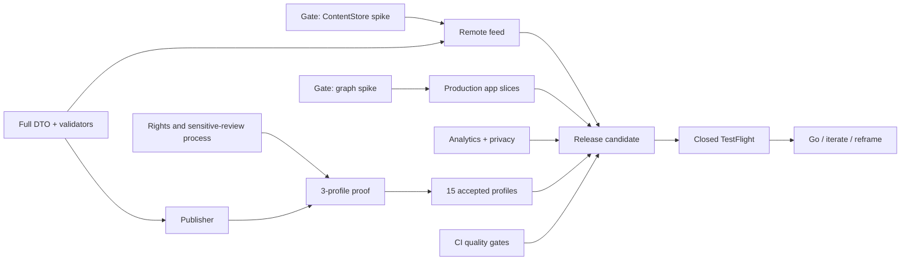

# План: реализация MVP «Кода миллиарда»

## Scope и Definition of Done

План доводит существующие graph и storage spike до закрытого внешнего TestFlight для iPhone, portrait-only, iOS 18+. MVP проверяет ценность редакционного исследования происхождения капитала и доказательных связей, а не масштаб каталога или монетизацию.

MVP готов, когда:

- все FR-001—FR-014 и NFR-001—NFR-010 из `docs/product/requirements.md` приняты проверками;
- в release dataset находятся 15 прошедших редакционный, лицензионный, schema и domain audit профилей;
- bundled seed открывает рабочий опыт без сети, а remote refresh не может уничтожить last-known-good snapshot;
- renderer прошёл performance и ручной accessibility audit на реальном iOS 18-устройстве;
- Firebase-конфигурация, privacy artifacts и custom-event allowlist проверены на фактическом Release archive;
- publisher воспроизводимо создаёт immutable dataset/media, публикует manifest последним и поддерживает проверенный rollback;
- закрытая внешняя TestFlight-группа может пройти четырёхнедельную проверку по заранее заданным метрикам;
- отсутствуют открытые publication blockers B-001—B-004.

Не входят в scope: аккаунты, платежи, push, избранное, шаринг, deep links, CMS, iPad/landscape, Android/web, публичный App Store, пользовательский path builder и real-time wealth tracker.

## Подтверждённое текущее состояние

- Product scope, русское название, iOS-first, 15 профилей, closed TestFlight и evidence semantics имеют статус `accepted`.
- В working tree есть generated SwiftUI scaffold, bundled source-backed seed, actor-isolated `ContentStore`, fallback `current → previous → seed`, people-only `GraphAtlas` из пяти глав и unit-тесты graph/storage границ.
- На 2026-09-03 `./scripts/lint` проходит без нарушений.
- На 2026-09-03 `./scripts/test` не стартует: среда не может получить список iPhone Simulator через CoreSimulatorService. Это отсутствие доказательства, а не доказанный дефект тестов.
- Remote feed, полный schema v1 consumer, publisher, Cloudflare, Firebase, Profile/Settings flows, CI и release QA отсутствуют.
- Ни один кандидатный профиль пока не имеет статуса `accepted-for-mvp`; права на wealth estimates и portrait media не подтверждены.
- Текущие изменения chapter-atlas не закоммичены; план не предполагает их автоматическое принятие как production-кода.

## Решения, ограничения и открытые вопросы

### Рабочие решения

1. Три полностью проверенных профиля образуют внутренний editorial/product proof, но не заменяют 15 профилей в release dataset.
2. Graph и ContentStore spike проходят явные gates; после этого код либо принимается и дорабатывается, либо заменяется новым ADR.
3. Content tooling и iOS consumer используют одни golden fixtures.
4. Внешний TestFlight начинается только после снятия B-001—B-004; локальная и внутренняя QA-сборка могут появиться раньше.
5. Оценки сроков не фиксируются до измерения редакционной трудоёмкости первых трёх профилей и стабилизации toolchain/CI.

### Blocking questions для перевода плана в `ready`

- Подтвердить трактовку конфликта документов: требование MVP говорит о 15 профилях, а этап 3 roadmap упоминает три. По умолчанию этот план считает 3 внутренним proof, 15 — условием внешнего TestFlight.
- Определить владельцев и доступы к Apple Developer/App Store Connect, Firebase, Cloudflare и домену feed/media.
- Зафиксировать юридически допустимый способ использования wealth estimates и портретов, а также владельца sensitive review/corrections.
- Назвать самое слабое доступное реальное устройство с iOS 18 для performance gate либо явно согласовать заменяющий device matrix.

### Неблокирующее неизвестное

- Английское storefront name не нужно закрывать для русскоязычного closed TestFlight.
- Монетизация и public App Store остаются за границей этой поставки.
- Signed manifest не нужен при текущем threat model; его нельзя незаметно добавить без нового ADR.

## Карта зависимостей

## Задачи

### TASK-001: Graph spike получает формальное решение

- Outcome: зафиксирован pass/fail отчёт и принято решение сохранить ADR-0007 renderer либо заменить его новым ADR.
- Platform/role: iOS engineer + QA + product/design.
- Scope: current chapter atlas, morph, portal/swipe, temporary magnification, panel detents, Dynamic Type extremes, Reduce Motion, VoiceOver, Voice Control, Switch Control и frame-time measurement на выбранном устройстве.
- Out of scope: новые главы, mixed graph и визуальная полировка вне критериев spike.
- Depends on: доступное реальное устройство; текущая незакоммиченная atlas-итерация.
- Acceptance criteria:
  - [ ] Все критические действия доступны без жеста и без hit testing линии.
  - [ ] Нет кадров длиннее 33 ms в согласованном повторяемом сценарии morph.
  - [ ] Нет blocking accessibility findings.
  - [ ] Решение и доказательства сохранены в документации.
- Verification: Instruments/signposts или эквивалентный trace, ручной accessibility checklist, build/test evidence.
- Documentation impact: ADR-0007, roadmap, UX и iOS architecture.
- Integration checkpoint: Renderer Gate.

### TASK-002: ContentStore spike получает формальное решение

- Outcome: подтверждена или отвергнута архитектура actor-isolated store и fallback `current → previous → seed`.
- Platform/role: iOS engineer + QA.
- Scope: concurrent refresh, cancellation, corruption, disk full, interruption before/after swap, orphan cleanup и rollback.
- Out of scope: HTTP client и production hosting.
- Depends on: существующие `ContentStore`, `FileContentCache` и fixtures.
- Acceptance criteria:
  - [ ] Ни один injected failure не удаляет current/previous.
  - [ ] Параллельные операции не публикуют частичный snapshot.
  - [ ] Startup восстанавливается после обоих interruption points.
  - [ ] Решение T-003 обновлено доказательствами.
- Verification: deterministic filesystem/concurrency tests с fault-injection doubles.
- Documentation impact: ADR-0002, content delivery, iOS architecture, decision register.
- Integration checkpoint: Storage Gate.

### TASK-003: Swift consumer полностью реализует schema v1

- Outcome: transport JSON преобразуется в immutable domain snapshot только после schema-compatible decode и всех domain invariants.
- Platform/role: iOS engineer.
- Scope: manifest/content DTO, exact money/date types, closed enums, cross-reference validation, 15-profile release invariant и golden fixtures.
- Out of scope: schema v2 и partial dates.
- Depends on: accepted JSON schemas и domain model.
- Acceptance criteria:
  - [ ] Все valid fixtures принимаются Swift consumer.
  - [ ] Все schema-invalid и domain-invalid fixtures отклоняются целиком.
  - [ ] DTO не доступны feature layer.
  - [ ] Тяжёлая validation не выполняется на `MainActor`.
- Verification: unit/fixture tests, strict-concurrency build, profiler spot check.
- Documentation impact: content model и contracts fixture guide при обнаружении расхождений.
- Integration checkpoint: Content Contract Gate.

### TASK-004: Remote manifest client соблюдает trust contract

- Outcome: клиент безопасно получает и проверяет manifest и immutable dataset.
- Platform/role: iOS engineer.
- Scope: ATS HTTPS, host allowlist, до трёх redirects, 128 KiB/5 MiB streaming limits, 15-second timeout, minimum reader build и SHA-256 exact bytes.
- Out of scope: signed manifest, Cloudflare-specific API и media cache.
- Depends on: TASK-003; конкретные manifest URL и allowlisted hosts.
- Acceptance criteria:
  - [ ] HTTP, чужой redirect, oversize, checksum mismatch и unsupported schema отклоняются типизированно.
  - [ ] URL/body/path не попадают в ошибки, UI или analytics.
  - [ ] Cancellation удаляет temp и не меняет pointers.
- Verification: `URLProtocol` integration tests для response/error matrix.
- Documentation impact: content delivery при изменении фактического контракта.
- Integration checkpoint: Remote Feed Gate.

### TASK-005: ContentStore выполняет production refresh lifecycle

- Outcome: foreground refresh коалесцируется, соблюдает шестичасовой интервал и атомарно публикует только валидный snapshot.
- Platform/role: iOS engineer.
- Scope: manifest revision, cached-hash reuse, temp download, validation, promote, refresh metadata и typed states.
- Out of scope: background fetch.
- Depends on: TASK-002, TASK-003, TASK-004.
- Acceptance criteria:
  - [ ] Startup UI не ждёт сеть.
  - [ ] Одновременные refresh используют одну operation.
  - [ ] Сбой refresh сохраняет доступный snapshot.
  - [ ] Rollback на прежний hash активируется новым manifest revision.
- Verification: integration tests store + network + filesystem; offline launch scenario.
- Documentation impact: content delivery и iOS architecture.
- Integration checkpoint: Remote Feed Gate.

### TASK-006: App composition публикует все content states

- Outcome: root flow различает seed, cached, refreshing, fresh, stale, requiresAppUpdate и fatalSeedFailure.
- Platform/role: iOS engineer.
- Scope: `ContentRepository` boundary, lifecycle cancellation, foreground refresh и recovery UI.
- Out of scope: profile/relationship presentation.
- Depends on: TASK-005.
- Acceptance criteria:
  - [ ] Каждый action-changing state имеет однозначное UI-поведение.
  - [ ] Requires-update и refresh failure не скрывают last-known-good content.
  - [ ] Fatal seed failure показывает локализованный blocking recovery экран.
- Verification: view-model tests и UI tests на state doubles.
- Documentation impact: UX state table при расхождении.
- Integration checkpoint: App Shell Gate.

### TASK-007: Локальная дата выбирает выпуск человека дня

- Outcome: запуск детерминированно выбирает edition для локальной даты с корректным fallback.
- Platform/role: iOS engineer.
- Scope: date-only/clock abstraction, timezone boundaries, fallback edition и `featured_view` trigger point.
- Out of scope: server-side scheduling и push.
- Depends on: TASK-003, TASK-006.
- Acceptance criteria:
  - [ ] Доступный сегодняшний выпуск выбирается для локальной календарной даты.
  - [ ] При отсутствии выпуска используется валидный fallback.
  - [ ] Timezone/DST cases покрыты тестами.
- Verification: unit tests с controlled clock/calendar.
- Documentation impact: content model/UX только при уточнении fallback semantics.
- Integration checkpoint: Core Experience Gate.

### TASK-008: Production graph flow соответствует принятому renderer contract

- Outcome: пользователь исследует главы, выбирает человека и возвращается к сохранённым selection/chapter после дочерней навигации.
- Platform/role: iOS engineer.
- Scope: результаты TASK-001, stable layout, selected-only routes, panel detents, structured relationships и supported accessibility actions.
- Out of scope: arbitrary pan, runtime physics и user path builder.
- Depends on: TASK-001, TASK-006, TASK-007.
- Acceptance criteria:
  - [ ] Layout не меняется от selection/magnification.
  - [ ] Disputed status различим без опоры только на линию.
  - [ ] Навигация в profile/relation и назад сохраняет context.
  - [ ] Все touch targets не меньше 44×44 pt.
- Verification: unit, UI, manual accessibility и performance regression tests.
- Documentation impact: UX/architecture при изменениях после spike.
- Integration checkpoint: Core Experience Gate.

### TASK-009: Список людей и локальный поиск работают без утечки запроса

- Outcome: пользователь открывает редакционно упорядоченный список и находит человека по русскому имени локально.
- Platform/role: iOS engineer.
- Scope: header entry, rows with wealth date/stale state, local normalization/filtering и переход в первую главу человека.
- Out of scope: search history, ranking и remote search.
- Depends on: TASK-006, TASK-008.
- Acceptance criteria:
  - [ ] Поиск работает по локализованному имени и пустому запросу.
  - [ ] Текст запроса не передаётся analytics/logging.
  - [ ] Выбор человека закрывает список и открывает корректную главу.
- Verification: unit tests search mapping, spy analytics/logging tests, UI scenario.
- Documentation impact: none if UX contract is preserved.
- Integration checkpoint: Core Experience Gate.

### TASK-010: Профиль объясняет происхождение состояния

- Outcome: полный профиль показывает все десять обязательных content blocks и корректно обрабатывает stale estimate.
- Platform/role: iOS engineer + editorial QA.
- Scope: story, wealth/components, starting conditions, timeline, education, disputes и last reviewed date.
- Out of scope: comments, bookmarks, sharing и dynamic financial calculations.
- Depends on: TASK-003; минимум один accepted profile из TASK-019.
- Acceptance criteria:
  - [ ] USD, дата, источник и слово «оценка» видны вместе.
  - [ ] Education statuses не подменяются.
  - [ ] Timeline содержит минимум шесть validated events.
  - [ ] Story completion определяется coarse bucket без точного reading telemetry.
- Verification: presentation mapping tests, snapshot/UI tests на representative profiles, editorial checklist.
- Documentation impact: UX при появлении фактической композиции.
- Integration checkpoint: Evidence Experience Gate.

### TASK-011: Relationship, claim и source образуют проверяемую цепочку

- Outcome: из structured relationship list пользователь доходит до claim bibliography и системного просмотра источника.
- Platform/role: iOS engineer + editorial QA.
- Scope: kind/period/status/explanation, supports/challenges, source tier/date и safe external URL opening.
- Out of scope: in-app web archive и tap по Canvas line.
- Depends on: TASK-003, TASK-008.
- Acceptance criteria:
  - [ ] Confirmed/disputed semantics совпадают с domain invariants.
  - [ ] Каждая существенная связь раскрывает claims и sources.
  - [ ] Source open не отправляет URL в telemetry.
  - [ ] Возврат сохраняет graph/profile context.
- Verification: navigation UI tests, domain/presentation tests, accessibility walkthrough.
- Documentation impact: none if evidence policy is preserved.
- Integration checkpoint: Evidence Experience Gate.

### TASK-012: Настройки публикуют обязательные сведения

- Outcome: пользователь может открыть versioned methodology, privacy, licenses и corrections channel.
- Platform/role: iOS engineer + privacy/legal/editorial.
- Scope: bundled/versioned documents, analytics disclosure, license attribution и correction contact.
- Out of scope: account settings и analytics opt-out.
- Depends on: закрытые решения B-002—B-004.
- Acceptance criteria:
  - [ ] Все четыре раздела доступны офлайн, кроме фактической отправки обращения.
  - [ ] Текст не обещает анонимность Firebase.
  - [ ] Версии документов и контакт исправлений указаны.
- Verification: content/legal review, UI/accessibility tests, offline manual scenario.
- Documentation impact: privacy policy, methodology, licenses/corrections artifacts.
- Integration checkpoint: Publication Gate.

### TASK-013: Изображения загружаются безопасно и не блокируют текст

- Outcome: лицензированные портреты отображаются из purgeable cache, а ошибки дают детерминированную монограмму.
- Platform/role: iOS engineer + editorial/media QA.
- Scope: HTTPS/host allowlist, checksum, image size guard, cache purge и placeholder.
- Out of scope: image editing and unlicensed media.
- Depends on: TASK-003; cleared media из TASK-019/TASK-020.
- Acceptance criteria:
  - [ ] Неуспех image request не скрывает content.
  - [ ] Неallowlisted или checksum-invalid media не отображается.
  - [ ] Attribution доступна в licenses.
- Verification: network/cache tests и offline UI scenario.
- Documentation impact: content delivery/licenses при расхождениях.
- Integration checkpoint: Publication Gate.

### TASK-014: Типизированная analytics boundary запрещает произвольные данные

- Outcome: feature layer может отправить только семь разрешённых custom events и закрытые параметры.
- Platform/role: iOS engineer + privacy reviewer.
- Scope: event enum, parameter types, session deduplication и Noop/spy compositions.
- Out of scope: Firebase SDK wiring.
- Depends on: зафиксированные trigger points TASK-007—TASK-011.
- Acceptance criteria:
  - [ ] Свободный словарь/строка не является feature API.
  - [ ] Debug/test violations fail assertion/test.
  - [ ] Search, URLs, error text, paths и PII не проходят mapping.
- Verification: exhaustive mapping and negative unit tests.
- Documentation impact: privacy analytics event table при любом изменении.
- Integration checkpoint: Analytics Gate.

### TASK-015: Hardened Firebase проходит фактический privacy audit

- Outcome: QA/TestFlight/Release отправляют разрешённые события, а Debug/previews/tests используют Noop/spy.
- Platform/role: iOS engineer + privacy/release engineer.
- Scope: pinned `FirebaseAnalyticsCore`, environment mapping, three Info.plist privacy keys, no AdSupport/IDFV, DebugView and archive privacy report.
- Out of scope: consent/opt-out и advertising products.
- Depends on: TASK-014; Firebase project/access.
- Acceptance criteria:
  - [ ] Package.resolved фиксирует согласованную SDK version.
  - [ ] Собранный bundle содержит все hardened keys правильного Boolean type.
  - [ ] Linked frameworks не содержат AdSupport.
  - [ ] Custom и auto-collected data отражены в policy/disclosure.
- Verification: unit spies, QA DebugView, linked-framework inspection, Release archive privacy report.
- Documentation impact: privacy analytics, privacy policy и App Store disclosure.
- Integration checkpoint: Analytics and Publication Gates.

### TASK-016: Publisher детерминированно компилирует редакционный исходник

- Outcome: Git-authored YAML/Markdown превращаются в reproducible schema-v1 JSON и immutable media manifest.
- Platform/role: content tooling engineer + editorial engineer.
- Scope: authoring validation, deterministic serialization, SHA-256, domain/editorial gates, license gates и shared golden fixtures.
- Out of scope: CMS and client changes.
- Depends on: TASK-003 contract; утверждённый authoring template.
- Acceptance criteria:
  - [ ] Два запуска на одном input дают byte-identical dataset.
  - [ ] Python/tooling и Swift consumer одинаково принимают/reject fixtures.
  - [ ] Publication blockers останавливают output до upload.
  - [ ] Generated artifact содержит provenance/version metadata.
- Verification: fixture parity tests, deterministic build test и invalid editorial cases.
- Documentation impact: publisher runbook и editorial workflow.
- Integration checkpoint: Content Pipeline Gate.

### TASK-017: Staging delivery поддерживает publish и rollback drill

- Outcome: staging Pages/R2 или эквивалентный HTTPS origin обслуживает immutable payload/media и manifest-last publication.
- Platform/role: DevOps/content tooling engineer.
- Scope: least-privilege credentials, staging preview, availability checks, host allowlist, audit trail и rollback to previous hash via newer revision.
- Out of scope: production public launch и signed manifest.
- Depends on: TASK-004, TASK-016; Cloudflare/domain access.
- Acceptance criteria:
  - [ ] Dataset/media immutable после публикации.
  - [ ] Manifest меняется последним только после availability checks.
  - [ ] Rollback drill восстанавливает предыдущий content в клиенте.
  - [ ] Credentials отсутствуют в repo/app bundle.
- Verification: staging end-to-end publish/update/rollback runbook execution.
- Documentation impact: content delivery and engineering operations runbook.
- Integration checkpoint: Content Pipeline Gate.

### TASK-018: Publication policy снимает rights/legal blockers

- Outcome: B-001—B-004 имеют проверяемые процедуры и назначенные ответственные роли.
- Platform/role: editorial lead + legal/privacy reviewer.
- Scope: wealth reuse basis, media licenses/attribution, sensitive claims review, correction channel, retention/regions decision.
- Out of scope: изменение продуктовой evidence policy.
- Depends on: доступ к правообладателям/юридической экспертизе.
- Acceptance criteria:
  - [ ] Для каждого типа данных определён допустимый источник и evidence record.
  - [ ] Profile cannot become accepted while any mandatory audit field is blocked.
  - [ ] Correction and sensitive-review workflows rehearsed on one profile.
- Verification: signed-off checklist and audit records, not code tests.
- Documentation impact: decision register, evidence policy, privacy/licensing/corrections artifacts.
- Integration checkpoint: Publication Gate.

### TASK-019: Три профиля проходят полный editorial proof

- Outcome: три связанных профиля имеют `accepted-for-mvp` и измеренную редакционную себестоимость.
- Platform/role: editorial team + content tooling engineer + product reviewer.
- Scope: все обязательные sections, минимум шесть timeline events, минимум пять evidence edges, wealth/media rights и sensitive review.
- Out of scope: оставшиеся 12 profiles.
- Depends on: TASK-016, TASK-018.
- Acceptance criteria:
  - [ ] Каждый профиль проходит schema/domain/editorial gates.
  - [ ] 100% relationships имеют claims/sources; 100% media имеют license metadata.
  - [ ] Время, стоимость и причины rework записаны по этапам.
  - [ ] Три профиля образуют связный сценарий для полного app walkthrough.
- Verification: editorial audit matrix, publisher output и iOS consumer acceptance.
- Documentation impact: roster/audit records и roadmap с фактической себестоимостью.
- Integration checkpoint: Editorial Proof Gate.

### TASK-020: Release dataset содержит 15 принятых профилей

- Outcome: editorial proof масштабирован до ровно 15 прошедших audit профилей.
- Platform/role: editorial team + content tooling engineer.
- Scope: candidate/reserve selection, consistency across shared entities/claims, monthly estimate freshness и media attribution.
- Out of scope: сотни профилей и real-time updates.
- Depends on: TASK-019; решение продолжать после cost review.
- Acceptance criteria:
  - [ ] Ровно 15 profiles имеют `accepted-for-mvp`.
  - [ ] Dataset проходит publisher и Swift validation.
  - [ ] Нет критических фактических ошибок и незакрытых license/sensitive gates.
  - [ ] First-day/next-day editions and fallback are editorially reviewed.
- Verification: final content audit, cross-record validator и app walkthrough sampling all profiles.
- Documentation impact: roster, audit matrix and release content notes.
- Integration checkpoint: Release Content Gate.

### TASK-021: CI воспроизводит обязательные quality gates

- Outcome: pull request pipeline проверяет tool versions, generation drift, lint, fixtures, unit/UI tests и unsigned simulator build.
- Platform/role: DevOps/iOS engineer.
- Scope: pinned toolchain, simulator destination, cache strategy, artifact retention и branch protection recommendation.
- Out of scope: automatic TestFlight upload.
- Depends on: stable test suites TASK-001—TASK-016; runner with Xcode 26.2.
- Acceptance criteria:
  - [ ] Clean checkout выполняет pipeline без ручных локальных артефактов.
  - [ ] Generated drift и fixture mismatch fail job.
  - [ ] Secrets не доступны untrusted execution paths.
- Verification: successful clean CI run and intentional-failure checks.
- Documentation impact: engineering operations/README.
- Integration checkpoint: Release Engineering Gate.

### TASK-022: Release candidate проходит независимый QA и privacy/content audit

- Outcome: одна подписанная build признана готовой для external TestFlight.
- Platform/role: QA + release engineer + editorial/privacy reviewers.
- Scope: FR/NFR traceability, offline/update/rollback, accessibility, performance, device matrix, content sampling, analytics and archive artifacts.
- Out of scope: публикация в public App Store.
- Depends on: TASK-008—TASK-021; signing/App Store Connect access.
- Acceptance criteria:
  - [ ] Каждое FR/NFR имеет сохранённое evidence.
  - [ ] Нет open severity-1/2 defects или publication blockers.
  - [ ] Actual archive privacy report and linked SDK inspection accepted.
  - [ ] Version/build/content revision reproducibly identified.
- Verification: signed QA report, release checklist and TestFlight internal smoke test.
- Documentation impact: release checklist, known limitations and test evidence.
- Integration checkpoint: External TestFlight Gate.

### TASK-023: Четырёхнедельный TestFlight experiment даёт решение

- Outcome: получено заранее определённое `go`, `iterate` или `reframe / no-go` решение.
- Platform/role: product manager + researcher + analytics reviewer.
- Scope: 50–100 qualified testers, 12–15 interviews, activation/graph depth/D7/story metrics, privacy-compliant analysis and incident monitoring.
- Out of scope: App Store conversion, price and willingness-to-pay conclusions.
- Depends on: TASK-022.
- Acceptance criteria:
  - [ ] Recruitment quotas and four-week window documented before start.
  - [ ] Metrics computed by predeclared definitions and interpreted with sampling uncertainty.
  - [ ] Interviews include high/medium/low actual engagement.
  - [ ] Decision cites guardrails, quantitative evidence and competing explanation.
- Verification: experiment report and decision record.
- Documentation impact: MVP validation results, roadmap and decision register.
- Integration checkpoint: Product Decision Gate.

## Cross-cutting coverage

| Контур | Состояние | Задачи или основание | Вопрос |
| --- | --- | --- | --- |
| Demo app | not-applicable | Само iOS-приложение является проверяемым продуктом; отдельного SDK нет | — |
| Analytics | applicable | TASK-007, TASK-010, TASK-014, TASK-015, TASK-023 | Подтвердить Firebase project/retention/regions |
| Logging | applicable | TASK-004—TASK-006; typed error codes и OSLog privacy redaction | Нужна ли выгрузка локальных diagnostics от тестеров без PII? |
| Manual test cases | applicable | TASK-001, TASK-012, TASK-017, TASK-022 | Зафиксировать device matrix |
| Automated tests | applicable | TASK-002—TASK-016, TASK-021 | Определить CI runner с Xcode 26.2 |
| Mobile bank integration | not-applicable | Продукт не является SDK/функцией мобильного банка | — |

## Критический путь и параллельные потоки

Критический путь к внешнему TestFlight:

1. Закрыть rights/legal/privacy ownership (TASK-018).
2. Реализовать общий contract и publisher (TASK-003, TASK-016).
3. Выпустить три доказанных профиля и измерить себестоимость (TASK-019).
4. Принять go на масштабирование и завершить 15 профилей (TASK-020).
5. Параллельно принять graph/storage spikes и закончить remote/product slices (TASK-001—TASK-015).
6. Поднять CI/staging и пройти rollback (TASK-017, TASK-021).
7. Собрать, подписать и независимо проверить release candidate (TASK-022).
8. Провести TestFlight experiment (TASK-023).

Параллельно после закрытия blocking inputs могут идти четыре потока:

- iOS: TASK-001—TASK-015;
- editorial/legal: TASK-018—TASK-020;
- content platform: TASK-003, TASK-016, TASK-017;
- quality/release: подготовка TASK-021—TASK-023 без преждевременной публикации.

Нельзя безопасно параллелить scaling до 15 профилей до TASK-019: без измеренной трудоёмкости и подтверждённых rights проект рискует дорого произвести непубликуемый контент.

## Риски и интеграционные checkpoints

| Риск | Ранний сигнал | Реакция | Gate |
| --- | --- | --- | --- |
| Wealth/media нельзя законно использовать | B-001/B-002 не снимаются на первом профиле | сменить источник/методику/кандидата до масштабирования | Publication |
| Atlas красив, но недоступен или нестабилен | >33 ms frame, gesture conflict, assistive-tech blocker | новый renderer ADR до production polishing | Renderer |
| Storage corrupts last-known-good | fault injection меняет/удаляет pointers | не начинать remote rollout, пересмотреть cache protocol | Storage |
| Schema/tooling расходятся | fixture parity failure | contract-first исправление до контента | Content Contract |
| Firebase собирает больше заявленного | archive report/DebugView расходятся с policy | остановить external release и обновить config/disclosure | Analytics |
| Редакционная стоимость не масштабируется | первые 3 profiles превышают допустимый budget | сузить/переформулировать MVP отдельным продуктовым решением | Editorial Proof |
| 15 профилей дают каталог, но не связанную сеть | graph depth невозможен в editorial walkthrough | пересобрать roster/edges до release content freeze | Release Content |

## Готовность всей спецификации

План можно перевести в `ready`, когда закрыты четыре blocking questions, указан owner плана и подтверждено, что три профиля являются внутренним proof, а 15 — условием внешнего MVP. Реализация считается завершённой только после TASK-023; загрузка build в TestFlight сама по себе не доказывает достижение продуктовой цели.
