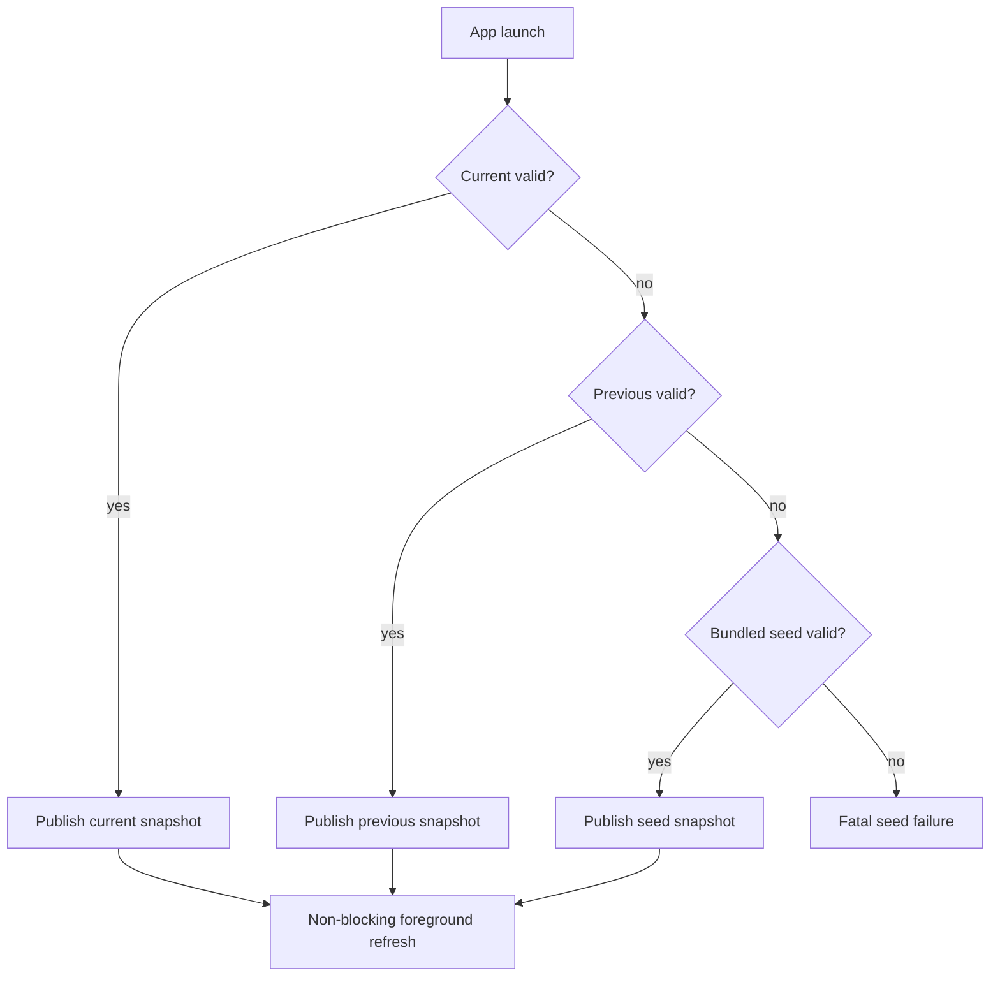
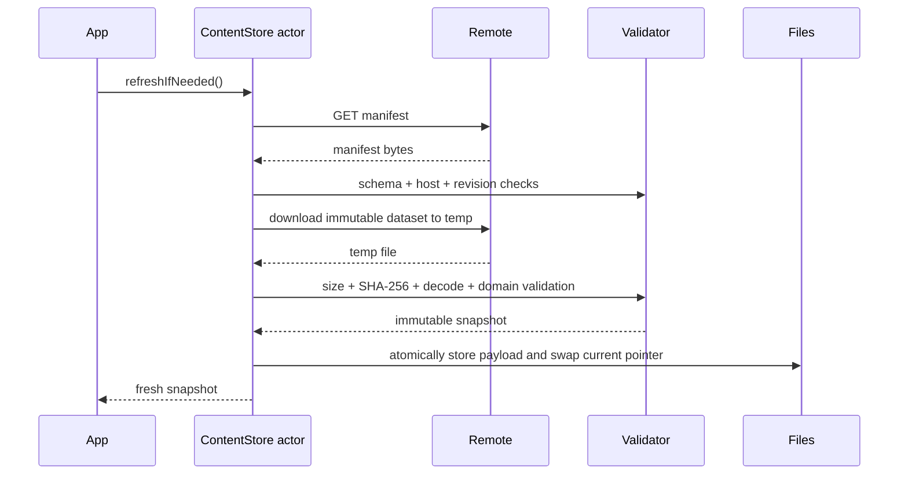

# Доставка и обновление контента

- Статус: `proposed`
- Клиентский контракт: provider-agnostic HTTPS
- Предлагаемый hosting: Cloudflare Pages + R2
- Последнее обновление: 2026-09-01

## Назначение

Документ определяет bootstrap, refresh, проверку, хранение и rollback read-only редакционного контента. Создание publisher и настройка Cloudflare не входят в текущий этап.

## Границы

Клиент знает:

- compile-time manifest URL;
- allowlisted content/media hosts;
- JSON Schema и reader build;
- правила storage и refresh.

Клиент не знает Cloudflare API, credentials, bucket names или authoring workflow. Смена Pages/R2 на другой HTTPS-host не должна менять domain layer.

## Артефакты

### Manifest

Ограничение: 128 KiB. Поля определены в [manifest schema](../contracts/manifest-v1.schema.json):

- `schemaVersion`;
- monotonic `manifestRevision`;
- `minimumReaderBuild`;
- `publishedAt`;
- immutable dataset descriptor;
- media origin;
- allowlisted hosts.

### Dataset

Ограничение: 5 MiB точных скачиваемых байтов. URL content-addressed и заканчивается SHA-256 payload. Dataset после публикации не перезаписывается.

### Media

Изображения хранятся отдельно, имеют checksum и лицензионные метаданные в dataset. Media origin не является доверенным источником редакционных данных.

## Модель доверия

MVP доверяет ATS HTTPS и контролируемым origins. SHA-256 обнаруживает повреждение или несоответствие payload manifest, но не защищает от компрометации аккаунта/CDN, который может заменить и manifest, и checksum.

Подписанный manifest намеренно отложен. Если threat model потребует защиты от компрометации hosting, создаётся новый ADR с key generation, rotation, revocation и recovery.

## Bootstrap



Current/previous проходят checksum, decode и domain validation при записи. На startup допускается быстрая проверка metadata и файла; при признаке corruption выполняется полная повторная проверка перед fallback.

Bundled seed валидируется теми же fixtures/checks на build/release этапе. Его runtime failure считается дефектом bundle, а не сетевой ошибкой. Текущий app bootstrap фактически проходит `current → previous → musk-cluster-v1.json`; graph-domain validator декодирует сущности, claims, sources, relationships и editions и проверяет ссылочную целостность. Полный draft 2020-12 validator остаётся build/publisher gate, а не заявленной runtime-возможностью.

Текущий `musk-cluster-v1.json` — локальный source-backed design dataset с 13 людьми и скрытыми контекстными организациями. Предварительная оценка состояния `$891.9B` датирована 2026-09-01 и явно не снимает B-001. Неаудированные портреты в bundle не добавляются: до закрытия B-002 клиент показывает системный силуэт.

## Refresh

Refresh запускается на foreground, если с последней завершённой попытки прошло не меньше шести часов. Background fetch отсутствует.



Алгоритм:

1. Коалесцировать параллельные refresh.
2. Загрузить manifest с timeout 15 секунд.
3. Ограничить response 128 KiB.
4. Проверить HTTPS, allowlisted hosts, schema и `minimumReaderBuild`.
5. Если `manifestRevision` не новее уже обработанной, завершить без download.
6. Если content hash уже сохранён и валиден, активировать его без повторной загрузки.
7. Скачать dataset во временный файл с лимитом 5 MiB.
8. Разрешить до трёх redirects, каждый на allowlisted HTTPS host.
9. Проверить byte size и SHA-256 точных байтов.
10. Декодировать DTO и выполнить domain validation вне `MainActor`.
11. Сохранить immutable payload по hash.
12. Атомарно заменить небольшой current pointer; прежний current становится previous.
13. Опубликовать snapshot и revision.
14. Очистить temp; хранить seed, current и previous.

## Rollback

Rollback не уменьшает `manifestRevision`. Редакция публикует новый revision, который указывает на прежний immutable dataset hash. Клиент воспринимает его как новое решение manifest и может активировать уже сохранённый payload.

Это отделяет chronology управляющего решения от content version.

## Файловая модель

Предлагаемая логическая структура Application Support:

```text
Content/
  payloads/<sha256>.json
  current.json
  previous.json
  refresh-metadata.json
```

`current.json` и `previous.json` — маленькие metadata pointers, заменяемые атомарно. Каталог исключается из backup. Изображения хранятся в Caches и могут быть удалены системой.

## Ошибки и реакция

| Ошибка | Реакция |
|---|---|
| Timeout / offline / 5xx | Сохранить snapshot, записать типизированный refresh failure |
| 4xx manifest | Не retry в текущем foreground; сохранить snapshot |
| Redirect на чужой host | Отменить запрос как trust violation |
| Manifest > 128 KiB | Отклонить manifest |
| Dataset > 5 MiB | Остановить download и удалить temp |
| SHA mismatch | Удалить temp, не активировать |
| Unsupported schema | Состояние `requiresAppUpdate`, current остаётся доступен |
| Domain validation failure | Отклонить release целиком |
| Current corruption | Previous, затем seed |
| Partial download / cancellation | Удалить temp; pointer не меняется |
| Disk full | Очистить temp и media cache, повторить запись один раз; current/previous не удалять |
| Interruption до swap | Новый payload может остаться неактивным; startup garbage collection удаляет orphan позже |
| Interruption после swap | Atomic pointer указывает либо на старую, либо на новую полную версию |
| Fatal seed failure | Блокирующий recovery UI; исправление требует нового app build |

## Stale

Wealth estimate старше 45 календарных дней отображается как stale. Это presentation rule, не повод отбрасывать snapshot. Дата dataset и дата estimate показываются раздельно.

## Publisher contract

Будущий publisher выполняет:

1. authoring validation;
2. JSON Schema;
3. domain и редакционные invariants;
4. deterministic serialization;
5. SHA-256 и immutable filename;
6. загрузку dataset/media;
7. проверку доступности;
8. последнюю атомарную публикацию manifest.

Publisher не реализуется сейчас. Python и Swift consumer должны использовать одинаковые golden fixtures.

## Наблюдаемость

Analytics получает только `content_refresh` с result/cache state/error code enum. URL, payload, filesystem path и текст ошибки не отправляются. OSLog использует privacy redaction.

## Связанные документы

- [Content model](../domain/content-model.md)
- [Content schema](../contracts/content-v1.schema.json)
- [ADR offline feed](../adr/0002-offline-content-feed.md)
- [ADR HTTPS trust](../adr/0006-https-manifest-trust.md)
