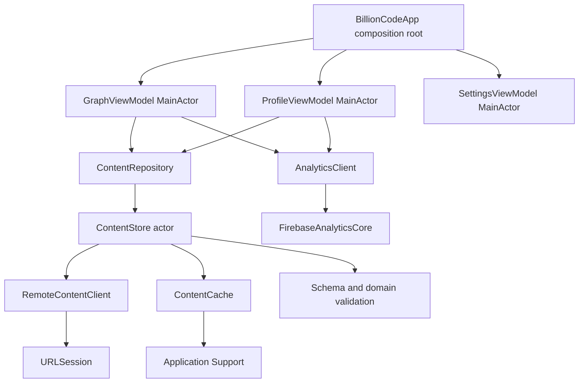

# Предлагаемая iOS-архитектура

- Статус: `proposed`
- Фактическое состояние: scaffold запускает локальный dense-graph fixture с 26 людьми, компаниями и университетами; source-backed `ContentStore` и прежний `GraphAtlas` сохранены, но не являются текущим root screen; production MVP отсутствует
- Платформа: iPhone, portrait-only, iOS 18+
- UI: SwiftUI
- Последнее обновление: 2026-09-01

## Назначение и аудитория

Документ задаёт границы будущей production-реализации для iOS-инженеров. Graph spike уже отделяет canonical content от presentation: `GraphContentProjector` скрывает non-person nodes только в режиме `.peopleOnly`, агрегирует общий контекст при наличии общего evidence source, а `StableOrganicGraphLayout` один раз вычисляет координаты по сортированному входу, ID и layout version. Это не закрывает performance/accessibility audit, полный schema consumer и fault injection.

## Архитектурные принципы

- UI получает только полностью проверенный неизменяемый `ContentSnapshot`.
- Сеть, файлы, Firebase, clock и `UserDefaults` скрыты за инфраструктурными границами.
- Feature view models изолированы `@MainActor`; decode, checksum и domain validation не выполняются на `MainActor`.
- Слои и протоколы появляются вместе с реальной ответственностью, а не создаются пустыми заранее.
- Ошибка обновления не уничтожает рабочий snapshot.
- Transport DTO, domain и presentation models не смешиваются.

## Компоненты



`Firebase`, `URLSession`, filesystem и `UserDefaults` находятся только в `Infrastructure`.

## Предлагаемая физическая структура

Каталоги создаются только при появлении соответствующих типов:

```text
Main/
  App/                 lifecycle и composition root
  Core/                переносимые утилиты и протоколы только при повторном использовании
  Flows/
    Graph/              главный граф и нижняя панель
    Profile/            профиль и таймлайн
    Relationship/       карточка доказательной связи
    Settings/           методология, privacy, licenses, corrections
  Infrastructure/      сеть, files, analytics, image cache, preferences
  Model/
    Domain/             ContentSnapshot и доменные типы
    DTO/                manifest/content transport models
  Common/               доказанно общие UI-компоненты
  Resources/            assets, localization, plist, generated accessors
  UnitTests/            тесты, зеркалящие production-границы
```

Companion targets, database layer и отдельные packages не создаются в MVP.

## Presentation

### View

SwiftUI view отображает state и отправляет намерения: выбрать узел, раскрыть sheet, открыть профиль, relation или source. View не запускает сеть и не обращается к Firebase напрямую.

### ViewModel

`@MainActor` view model:

- владеет состоянием flow;
- запрашивает snapshot через consumer-owned protocol;
- преобразует domain в presentation data;
- управляет camera transform, selection и вычисленным двухшаговым highlight;
- отправляет типизированные analytics events;
- обрабатывает cancellation жизненного цикла.

### Навигация

Корневой Graph flow хранит camera/selection. Profile и Settings открываются через navigation stack или sheet без уничтожения graph view model. Конкретный router вводится только если стандартная локальная навигация перестаёт быть ясной.

## Граф

### Рендер

- `DenseGraphData` хранит presentation-узлы людей, компаний и университетов и ненаправленные подписанные рёбра.
- `DenseGraphLayout` детерминированно выполняет force simulation вне runtime-взаимодействия, затем нормализует свободную раскладку с сохранением пропорций.
- `Canvas` рисует прямые связи и малые подписи активного окружения.
- Узлы — позиционированные SwiftUI `Button` поверх Canvas; цвет и форма независимо кодируют тип сущности.
- `GraphCamera` хранит pan/zoom transform; в viewport создаются только видимые node views.
- Двухшаговая подсветка через компанию или университет требует пересечения распарсенных годовых интервалов. Неизвестный интервал не создаёт inferred highlight.
- Relationship detail открывается из доступного списка связей выбранного узла, а не tap по линии.

### Доступность

Каждая node button имеет label, kind и selection state. Отдельный структурированный список использует те же domain IDs и actions. Reset camera доступен отдельным VoiceOver action.

### Лимиты

- текущий fixture: 26 людей и их основные публичные места учёбы и работы;
- world-сцена `10000 × 10000`, масштаб камеры `0.035...0.24`;
- touch target ≥ 44×44 pt;
- dataset ≤ 5 MiB.

Эти значения — spike targets, а не доказанная производительность.

## ContentRepository и ContentStore

`ContentRepository` предоставляет features read-only snapshot и поток его состояний. Конкретный `ContentStore` является actor и сериализует bootstrap/refresh/swap.

Предлагаемые обязанности:

- открыть current/previous/seed;
- опубликовать immutable snapshot;
- не чаще одного раза в шесть часов проверить manifest на foreground;
- отменить устаревший refresh при новом запросе;
- проверить download вне `MainActor`;
- атомарно заменить current pointer;
- сохранять previous fallback;
- выдавать типизированное состояние и безопасную ошибку.

`ContentStore` не форматирует пользовательский текст и не решает редакционную допустимость: правила уже применены publisher и повторно проверяются domain validator.

## Модели

- `...DTO` — точное Codable-представление JSON Schema.
- Domain types — проверенные сущности без optionals, которые уже разрешены validation.
- Presentation data — локальные для feature строки, секции и view state.
- SwiftData models отсутствуют.

Денежные строки декодируются в точный decimal/integer domain type, а не `Double`. Даты используют отдельные date-only и timestamp representations, чтобы timezone не менял редакционную дату.

## Concurrency

- UI state и navigation — `@MainActor`.
- `ContentStore`, file coordination и refresh state — actor.
- URLSession download — async/await.
- Hashing, decode и validation — detached/non-main execution с явной cancellation.
- Snapshot передаётся как immutable `Sendable` graph.
- Одновременные foreground refresh коалесцируются в одну operation.

Strict Swift 6 concurrency включается с начала проекта. `@unchecked Sendable` запрещён без отдельного documented review.

## Изображения

`ImageRepository` проверяет allowlisted HTTPS origin и использует URLCache/purgeable disk cache. Медиа не блокируют показ текста; при ошибке используется локальный placeholder. Application Support содержит только dataset, а изображения — Caches.

## Analytics

Features зависят от `AnalyticsClient`, принимающего закрытый enum event. Preview, Debug и tests получают `NoopAnalyticsClient` или spy; QA/TestFlight/Release — Firebase adapter. Свободный словарь параметров не является публичной границей feature.

## Ошибки

Инфраструктурные ошибки преобразуются в закрытый enum без URL, путей, payload и PII. UI различает только состояния, которые меняют действие пользователя: stale, requires update, fatal seed failure. Подробности остаются в локальном OSLog с privacy redaction.

## Локализация и ресурсы

- Каноническая локаль — `ru`.
- Пользовательские строки не хардкодятся в Swift.
- SwiftGen предоставляет типобезопасный доступ.
- Семантические colors и images разделены по asset catalogs.
- Accessibility labels локализуются тем же способом.
- Generated accessors коммитятся, чтобы проект мог собраться после генерации без повторного SwiftGen run.

## Инварианты

- View не видит DTO.
- Firebase и filesystem не импортируются во Flows.
- Невалидный dataset никогда не становится snapshot.
- Сеть не блокирует первый render.
- Selection и camera transform не изменяют рассчитанный layout.
- UI-связь и доступный список используют один relationship ID.
- Feature не создаёт протокол без заменяемой инфраструктурной границы.

## Spike перед production

### Graph spike

Проверить pan/zoom, reset camera, длинные имена, временные пересечения, Dynamic Type, VoiceOver, Voice Control, Reduce Motion, hit mapping и frame performance на самом слабом доступном iOS 18-устройстве.

Текущий результат: root screen использует локальный design/performance fixture и единую Obsidian-подобную сцену. Реализованы разные формы и цвета людей, компаний и университетов, прямые ненаправленные связи, малые подписи period/detail, pan/zoom, viewport culling и детерминированная свободная раскладка. Выбор человека раскрывает организации и только тех людей, чьи периоды в общей организации пересекаются. Source-backed seed и прежние projectors сохранены, но расширенный fixture ещё не прошёл публикационный source audit. Реальный frame performance и ручные assistive-technology сценарии не измерены, поэтому T-001/T-009 остаются `proposed`; T-008 заменён ADR-0008.

### ContentStore spike

Проверить actor isolation, cancellation, temp download, checksum, decode, atomic swap, corruption, disk full, interruption и rollback.

Текущий результат: actor, fallback chain, bundled seed provider, validation-before-promotion, SHA-256 content addressing и атомарная запись файлов реализованы. Immutable `ContentSnapshot` переносит graph-сущности, relationships, claims, sources и editions. Runtime validator проверяет используемую graph-подвыборку и ссылочную целостность, но не заменяет полный JSON Schema gate. Remote download, cancellation, disk-full/interruption injection и recovery matrix не завершены, поэтому T-003 остаётся `proposed`.

Если spike не проходит, ADR не переписывается молча: создаётся новое решение о renderer/storage.

## Связанные решения

- [ADR-0001: native iOS](../adr/0001-native-ios-first.md)
- [ADR-0002: offline feed](../adr/0002-offline-content-feed.md)
- [ADR-0003: evidence graph](../adr/0003-evidence-graph.md)
- [ADR-0007: редакционный атлас глав — superseded](../adr/0007-chapter-atlas-renderer.md)
- [ADR-0008: единая evidence network в стиле Obsidian](../adr/0008-obsidian-evidence-network.md)
- [Доставка контента](content-delivery.md)
- [Инженерные правила](../engineering/project-guidelines.md)
