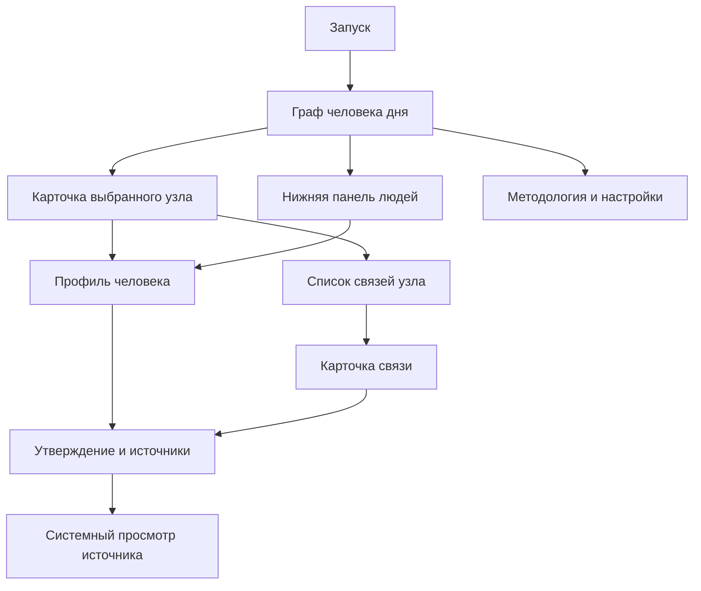

# Спецификация пользовательского опыта

- Статус продукта: `accepted`
- Статус реализации: `proposed`
- Устройства: iPhone, portrait-only, iOS 18+
- Последнее обновление: 2026-09-01

## Назначение и границы

Документ определяет информационную архитектуру, навигацию, состояния и accessibility-контракт MVP. Он не является визуальным макетом и не фиксирует конкретные шрифты, цвета или длительности анимаций до design/spike.

## Информационная архитектура

В MVP нет tab bar. Граф — корневой опыт; список людей является частью того же экрана. Профиль, карточка связи, источник и настройки открываются поверх или из navigation stack с предсказуемым возвратом к прежней позиции графа.

## Первый запуск

Отдельной маркетинговой карусели нет. После первого появления валидного графа показываются не более трёх одноразовых contextual hints:

1. «Нажмите на узел, чтобы изучить его».
2. «Потяните панель вверх, чтобы открыть список людей».
3. При первом открытии связи — «Сплошная линия подтверждена; пунктир означает документированный спор».

Hints не блокируют взаимодействие, доступны VoiceOver и не показываются повторно после закрытия. Их состояние хранится локально.

## Главный граф

### Композиция

- Верхняя область: название выпуска, локальная дата, кнопки методологии и настроек.
- Центральная область: world-сцена графа.
- Нижняя область: системно похожая на sheet панель со строкой человека дня и handle.
- Легенда связи доступна по кнопке, а не постоянно занимает экран.

### Поведение

- При запуске камера центрируется на человеке дня.
- Сначала показывается центральный узел и ограниченное ближайшее окружение.
- Tap по узлу выбирает его, открывает компактную карточку и плавно центрирует камеру.
- Раскрытие соседей не меняет world-координаты уже видимых узлов.
- Pan и zoom меняют только camera transform.
- Double tap не назначается критическому действию; все операции доступны обычным tap и кнопками.
- Одновременно отображается не более 40 узлов и 80 рёбер. При достижении лимита пользователь получает доступ к остальным связям через список.
- Reduce Motion заменяет длительный recenter на короткое растворение или мгновенную установку камеры.

### Узлы

В текущем people-only experiment узел — круглый портрет с выбранным ring и подписью «И. Фамилия». Если portrait с подтверждённой лицензией отсутствует, используется системный силуэт. Полное имя остаётся в accessibility label и нижней панели. Это presentation rule, а не удаление остальных entity kinds из schema или будущего mixed graph.

Для длинного имени граф показывает сокращённую форму, но полное имя доступно в карточке и accessibility. Touch target не меньше 44×44 pt даже при меньшем визуальном маркере.

### Рёбра

- `confirmed`: сплошная линия и текст «Подтверждённая связь».
- `disputed`: пунктирная линия, предупреждающий символ и текст «Связь оспаривается».

Ребро не является самостоятельным интерактивным объектом `Canvas`. Карточка связи открывается из списка отношений выбранного узла. Это предотвращает маленькие и недоступные hit targets.

## Нижняя панель выбранного человека

Состояния:

- `collapsed` — 128 pt плюс нижний safe area: handle, выбранный человек, краткое описание и число связей;
- `medium` — 52% доступной высоты: карточка человека и структурированный список связей;
- `expanded` — вся высота окна: панель закрывает header и сцену, а прокручиваемый контент учитывает safe areas.

Верхние углы имеют continuous radius 28 pt. Drag назначен header/handle панели, чтобы не конкурировать с прокруткой списка и pan графа. Snap учитывает predicted end translation и выбирает ближайший detent. При Reduce Motion detent меняется мгновенно. VoiceOver предоставляет действия «Развернуть» и «Свернуть».

Tap по основной области строки связи выбирает второго человека и центрирует камеру. Отдельная доступная кнопка информации открывает объяснение, контексты, claims и источники. Общий организационный контекст подписывается как совместная роль и не объявляется личным знакомством.

Список всех людей открывается отдельной кнопкой в header. В текущем spike он остаётся системным sheet с локальным поиском; объединение каталога людей с draggable-панелью отложено до проверки нового interaction contract.

Список по умолчанию упорядочен редакционно, а не объявляется строгим рейтингом. Каждая строка содержит имя, краткий источник капитала, датированную оценку и индикатор stale. Поиск локальный, без истории и отправки текста в Firebase.

После выбора человека sheet сворачивается, а камера центрируется на его узле. Выбор должен быть обратимым стандартной навигацией.

## Карточка узла

Компактная карточка содержит:

- полное имя и тип сущности;
- однострочное объяснение роли;
- число опубликованных связей;
- действия «Открыть профиль/карточку» и «Показать связи».

Для organization, university, foundation, family, deal и event используется компактная entity card. Полный редакционный профиль обязателен только для первых 15 людей.

## Профиль человека

Порядок блоков:

1. Hero: имя, портрет, краткое описание.
2. «Оценка состояния»: USD, дата, источник и методологическая оговорка.
3. «Из чего сложилось»: структурированные компоненты капитала.
4. «Путь»: краткий редакционный сюжет.
5. «Стартовые условия»: наследство, ранняя поддержка и привилегии.
6. Таймлайн.
7. Образование.
8. Доказательные связи.
9. Существенные споры.
10. Последняя проверка и список источников.

Сюжет не скрывает источники, но ссылки не вставляются в каждый абзац. Значимые claims открываются по метке источника или из соответствующей карточки.

## Карточка связи

Содержит:

- source и target;
- человекочитаемый kind;
- направление;
- период;
- `confirmed` или `disputed`;
- нейтральное объяснение;
- claims и источники;
- дату редакционной проверки.

Для `disputed` сначала показывается суть расхождения, затем минимум две документированные позиции. Формулировка «возможно связан» без доказательной базы запрещена.

## Источник

Карточка источника показывает publisher, title, автора при наличии, дату публикации, дату доступа, язык и source tier. Переход открывает HTTPS URL системным browser presentation. Приложение не копирует длинные фрагменты материала и не обещает доступность внешней страницы.

## Человек дня

Выбор выполняется по Gregorian calendar и `TimeZone.autoupdatingCurrent`:

- ключ расписания — `YYYY-MM-DD`;
- пересчёт выполняется на foreground и significant time change;
- смена timezone может изменить выпуск согласно новой локальной дате;
- если записи на дату нет, используется последний выпуск не позднее этой даты;
- если нет и его, используется явный fallback edition.

Смена дня не сбрасывает активную сессию посреди чтения. Новый выпуск применяется при следующем возврате к корневому экрану или foreground.

## Состояния данных

| Состояние | Поведение UI |
|---|---|
| `seed` | Контент доступен; ненавязчиво указано, что проверяется обновление |
| `cached` | Показывается сохранённая версия и дата её публикации |
| `refreshing` | Текущий контент остаётся интерактивным; блокирующего spinner нет |
| `fresh` | Специальный статус не требуется |
| `stale` | У суммы показано «Данные требуют обновления» и дата |
| `requiresAppUpdate` | Текущий snapshot остаётся доступен; предлагается обновить приложение |
| `fatalSeedFailure` | Блокирующий экран объясняет ошибку локальных данных; retry не симулирует восстановление без нового bundle |

Сетевая ошибка refresh показывается только в методологии/диагностическом состоянии или при явном обновлении. Она не заменяет валидный контент error-screen.

## Accessibility

- Узлы — SwiftUI `Button`, а не символы внутри `Canvas`.
- Accessibility focus следует за программным recenter только после завершения или отмены анимации.
- Для графа существует список «Связи выбранного узла» с теми же действиями.
- VoiceOver-порядок: заголовок выпуска → выбранный узел → действия → список связей → нижняя панель.
- Voice Control получает уникальные видимые названия действий.
- Switch Control не требует pan/zoom для достижения узла.
- Dynamic Type не изменяет world coordinates; увеличенный текст переносится в карточки и список.
- Контраст, статус и тип сущности не полагаются на один визуальный канал.

## Analytics touchpoints

UI отправляет только типизированные намерения. Он не знает Firebase и не передаёт поисковый текст, URL или пользовательский ввод. События описаны в [privacy-документе](../tech/privacy-analytics.md).

## Неопределённое до spike

- конкретный zoom range;
- визуальная форма узлов;
- длительности анимаций;
- необходимость иной технологии рендера;
- фактический performance budget на слабом iOS 18-устройстве.

Эти детали не меняют продуктовый контракт и должны быть зафиксированы после измерения.
