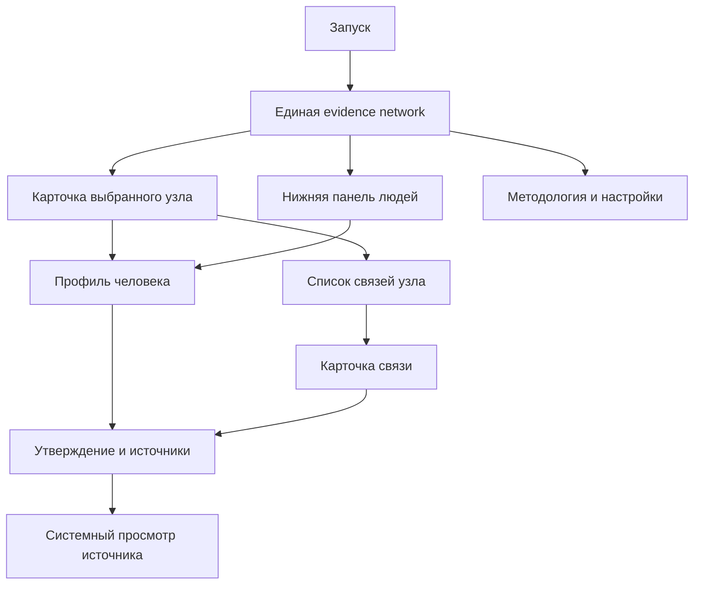

# Спецификация пользовательского опыта

- Статус продукта: `accepted`
- Статус реализации: `proposed`
- Устройства: iPhone, portrait-only, iOS 18+
- Последнее обновление: 2026-09-05

## Назначение и границы

Документ определяет информационную архитектуру, навигацию, состояния и accessibility-контракт MVP. Он не является визуальным макетом и не фиксирует конкретные шрифты, цвета или длительности анимаций до design/spike.

## Информационная архитектура

В MVP нет tab bar. Граф — корневой опыт; список людей является частью того же экрана. Каждая строка списка и поисковой выдачи использует портрет человека, а при отсутствии локального изображения — персональную монограмму. Профиль, карточка связи, источник и настройки открываются поверх или из navigation stack с предсказуемым возвратом к позиции камеры и выбору.

## Первый запуск

Отдельной маркетинговой карусели нет. После первого появления валидного графа показываются не более трёх одноразовых contextual hints:

1. «Нажмите на узел, чтобы изучить его».
2. «Потяните панель вверх, чтобы открыть список людей».
3. При первом открытии связи — «Сплошная линия подтверждена; пунктир означает документированный спор».

Hints не блокируют взаимодействие, доступны VoiceOver и не показываются повторно после закрытия. Их состояние хранится локально.

## Главный граф

### Композиция

- Граф занимает весь экран под overlays; системная light/dark тема не форсируется.
- Сцена едина: у неё нет центрального человека, редакционных глав и организационных территорий.
- Люди, компании и университеты представлены самостоятельными узлами.
- Человек — крупный круглый портретный маркер, компания — янтарный ромб, университет — фиолетовый треугольник. Тип различается и цветом, и геометрией.
- Локальный поиск по нодам занимает всю доступную ширину сцены внутри safe area.
- Поле поиска получает фокус одним tap. Выбор результата сохраняет запрос, закрывает результаты и клавиатуру и плавно переводит камеру к выбранной ноде. Клавиатуру можно скрыть отдельным действием без очистки запроса; повторный tap по полю возвращает результаты.
- Компактная легенда находится поверх сцены.

### Поведение

- Drag перемещает камеру и не выбирает ноду под началом или концом жеста; pinch изменяет постоянный масштаб в допустимых пределах.
- Tap по узлу не перестраивает layout: выбранное окружение усиливается цветом, остальная сеть приглушается.
- Для человека окружение включает его компании и университеты, а также людей с пересекающимися периодами участия в этих организациях.
- Совпадение организации без пересечения хотя бы одного года не подсвечивает второго человека. Неизвестный период не считается пересечением.
- Tap по компании или университету выделяет только прямые связи этой сущности.
- Повторный tap по выбранному узлу или tap по фону очищает selection.
- После выбора доступно явное действие «Собрать локальный граф». Оно оставляет до 20 наиболее релевантных нод выбранного окружения, скрывает остальную сеть и плавно раздвигает сохранённые связи. Выбранная нода сохраняет экранный anchor; выбор участника внутри локального графа перестраивает окружение вокруг него без скачка выбранной ноды.
- Действие «Показать весь граф» возвращает исходные позиции и камеру. Локальный граф также завершается при закрытии selection, изменении фильтров, переходе из досье или выборе через поиск ноды вне текущего окружения.
- Runtime-физики нет: общий layout остаётся стабильным, а локальная раскладка пересчитывается только при явном входе в focus mode или выборе другой ноды внутри него.

### Узлы

В текущем dense-graph experiment человек показан круглым портретом диаметром 34 pt внутри touch target 44×44 pt. Компании и университеты остаются меньшими геометрическими маркерами, чтобы люди сохраняли визуальный приоритет.

Полное имя подписывается у каждой видимой человек-ноды и рисуется поверх контекстных сущностей. Компании и университеты используют сокращённые названия. Полное имя каждой сущности остаётся в карточке и accessibility label; touch target не меньше 44×44 pt.

### Связи

- Все связи ненаправленные, прямые и без стрелок.
- Рабочая связь использует коралловый акцент, образование — фиолетовый, родство — бирюзовый.
- У активной связи период расположен с одной стороны линии, роль или программа — с другой; шрифт малый и вторичный.
- У неактивной сети линии тонкие и нейтральные, а при selection дополнительно приглушаются.
- Формулировки описывают проверяемый контекст: компанию, должность, вуз, программу или родство. Причинные выводы «кто кого привёл» запрещены.

`Canvas` рисует линии и подписи, но линия не является самостоятельным интерактивным объектом. Структурированный список отношений остаётся обязательным для полного MVP и accessibility.

## Нижняя панель выбранной ноды

Панель является контекстным «живым досье» плотной сети. Без selection она скрыта и не отнимает место у графа. После выбора человека, компании или университета панель появляется поверх нижней части сцены.

Состояния:

- `compact` — начальное превью на 40% доступной высоты; граф остаётся интерактивным;
- `expanded` — системный `large` detent с видимым верхним отступом, поэтому досье остаётся модальным, а не превращается в отдельный полноэкранный экран.

Новый выбор на графе сразу открывает `compact`. Размер, инерцию, согласование вертикальной прокрутки со свайпом и интерактивное закрытие реализует системный SwiftUI sheet. Свайп вверх раскрывает `expanded`, свайп вниз возвращает `compact`, а повторный свайп вниз закрывает досье и очищает selection. Кнопка в шапке переключает те же два состояния. При Reduce Motion программные переходы выполняются без пространственной анимации. Повторный tap по выбранной ноде также очищает selection.

Контент имеет один вертикальный поток. В `compact` горизонтальные группы можно листать независимо; вертикальный жест сначала раскрывает sheet. В `expanded` весь контент прокручивается, поэтому ни одна связь не становится недоступной из-за размера экрана или Dynamic Type.

Compact-досье человека показывает фото, полное имя и жизненные даты: для живого человека — дату рождения и текущий возраст, для умершего — даты рождения и смерти. Далее идут градиентная сумма состояния, текущие компании, мягкие фиолетовые облака вузов и датированный превью-таймлайн. Прошлые компании появляются после раскрытия и отмечаются серой точкой; действующие — зелёной. Для компании годы деятельности выводятся под названием, вид деятельности — в янтарном hero-блоке, а соучредители — отдельной группой синих облаков. Для университета конкретный тип выводится и в шапке, и в мягком фиолетовом hero-блоке; выпускники образуют самостоятельную синюю группу.

Tap по фото в шапке досье открывает полноэкранный popup портрета с attribution; при монограмме-заглушке действие отсутствует. Popup закрывается кнопкой или свайпом в любом направлении: портрет следует за жестом и уходит за соответствующий край, а короткое движение возвращает его на место. При Reduce Motion пространственная анимация закрытия отключается.

Expanded-досье человека добавляет прошлые компании, краткий сюжет, состав состояния и единую вертикальную хронологию. Отдельного блока «Компании и активы», кнопок доказательства и экрана «Доказательство» в досье нет. В строках хронологии компании и университеты различаются цветом; переход к связанной ноде обозначен стрелкой справа. Tap по связанной сущности переводит панель в `compact`, плавно перемещает новую ноду в видимую область графа над панелью и обновляет досье. Локальная кнопка назад тем же переходом восстанавливает предыдущий выбор и точное состояние камеры. Историческая динамика состояния показывается только при наличии минимум трёх сопоставимых оценок.

Expanded-досье компании сохраняет hero-блок деятельности и облака людей, затем добавляет краткое описание, основные факты и хронологию. Хронология объединяет датированные связи с редакционными событиями, включая подтверждённые судебные решения, кризисы управления, поглощения и громкие репутационные эпизоды.

Expanded-досье университета сохраняет фиолетовый hero-блок и синие облака выпускников, а затем добавляет описание, факты и датированную хронологию связей.

Список всех людей открывается отдельной кнопкой в header. В текущем spike он остаётся системным sheet с локальным поиском; объединение каталога людей с draggable-панелью отложено до проверки нового interaction contract.

Список по умолчанию упорядочен редакционно, а не объявляется строгим рейтингом. Каждая строка содержит имя, краткий источник капитала, датированную оценку и индикатор stale. Поиск локальный, без истории и отправки текста в Firebase.

После выбора человека sheet сворачивается, а камера центрирует его в общей сцене. Выбор должен быть обратимым стандартной навигацией.

## Карточка узла

Компактная карточка содержит:

- полное имя и тип сущности;
- однострочное объяснение роли;
- число опубликованных связей;
- действия «Открыть профиль/карточку» и «Показать связи».

Для organization, university, foundation, family, deal и event используется компактная entity card. Полный редакционный профиль обязателен только для первых 15 людей.

## Профиль человека

Порядок блоков:

1. Hero: имя, портрет, краткое описание.
2. «Оценка состояния»: сумма в USD и компоненты капитала; дата, источник и методологическая оговорка не выводятся в досье.
3. «Из чего сложилось»: структурированные компоненты капитала.
4. «Путь»: краткий редакционный сюжет.
5. «Стартовые условия»: наследство, ранняя поддержка и привилегии.
6. Таймлайн.
7. Образование.
8. Связи, доступные через облака и хронологию.
9. Существенные споры.
10. Последняя проверка и список источников.

Редакционные источники остаются частью content pipeline, но отдельное evidence-действие и экран доказательства не входят в текущее представление досье.

## Карточка связи

Содержит:

- source и target;
- человекочитаемый kind;
- направление;
- период;
- `confirmed` или `disputed`;
- нейтральное объяснение;
- claims и источники;
- дату редакционной проверки.

Для `disputed` сначала показывается суть расхождения, затем минимум две документированные позиции. Формулировка «возможно связан» без доказательной базы запрещена.

## Источник

Карточка источника показывает publisher, title, автора при наличии, дату публикации, дату доступа, язык и source tier. Переход открывает HTTPS URL системным browser presentation. Приложение не копирует длинные фрагменты материала и не обещает доступность внешней страницы.

## Человек дня

Выбор выполняется по Gregorian calendar и `TimeZone.autoupdatingCurrent`:

- ключ расписания — `YYYY-MM-DD`;
- пересчёт выполняется на foreground и significant time change;
- смена timezone может изменить выпуск согласно новой локальной дате;
- если записи на дату нет, используется последний выпуск не позднее этой даты;
- если нет и его, используется явный fallback edition.

Смена дня не сбрасывает активную сессию посреди чтения. Новый выпуск применяется при следующем возврате к корневому экрану или foreground.

## Состояния данных

| Состояние | Поведение UI |
|---|---|
| `seed` | Контент доступен; ненавязчиво указано, что проверяется обновление |
| `cached` | Показывается сохранённая версия и дата её публикации |
| `refreshing` | Текущий контент остаётся интерактивным; блокирующего spinner нет |
| `fresh` | Специальный статус не требуется |
| `stale` | У суммы показано «Данные требуют обновления» и дата |
| `requiresAppUpdate` | Текущий snapshot остаётся доступен; предлагается обновить приложение |
| `fatalSeedFailure` | Блокирующий экран объясняет ошибку локальных данных; retry не симулирует восстановление без нового bundle |

Сетевая ошибка refresh показывается только в методологии/диагностическом состоянии или при явном обновлении. Она не заменяет валидный контент error-screen.

## Accessibility

- Узлы — SwiftUI `Button`, а не символы внутри `Canvas`.
- Accessibility focus следует за выбором человека.
- Для графа существует список «Связи выбранного узла» с теми же действиями.
- VoiceOver-порядок: заголовок выпуска → легенда → видимые узлы → нижняя панель → список связей.
- Voice Control получает уникальные видимые названия действий.
- Switch Control не требует pan или pinch для достижения узла.
- Dynamic Type не изменяет нормализованные позиции; увеличенный текст переносится в карточки и список.
- Контраст, статус и тип сущности не полагаются на один визуальный канал.

## Analytics touchpoints

UI отправляет только типизированные намерения. Он не знает Firebase и не передаёт поисковый текст, URL или пользовательский ввод. События описаны в [privacy-документе](../tech/privacy-analytics.md).

## Неопределённое до spike

- cleared-портреты и их лицензионный audit;
- длительности анимаций после device-профилирования;
- необходимость иной технологии рендера;
- фактическое соблюдение бюджета 33 ms на слабом iOS 18-устройстве;
- ручные Dynamic Type и assistive-technology сценарии на полной сети и выделенном окружении.

Эти детали не меняют продуктовый контракт и должны быть зафиксированы после измерения.
